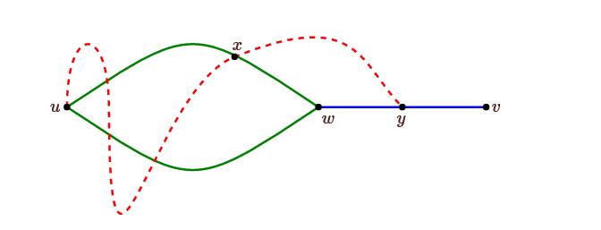
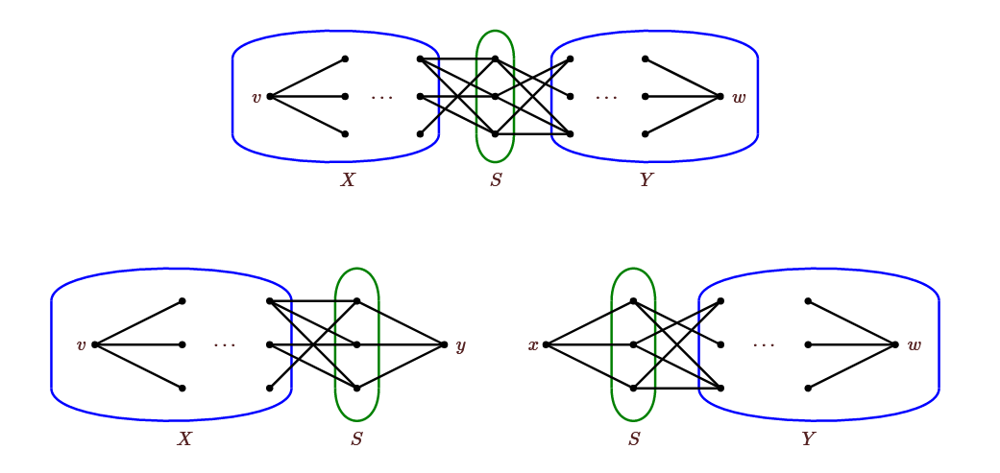

## Conectividad

Nosotros hemos visto ejemplos de grafos conexos y grafos  disconexos y podemos diferenciarlos. Si bien "no conectado" es prácticamente un tema sanjado, hay mucho que decir sobre "qué tan conectado" está un grafo conexo. El enfoque más simple de ver qué tan difícil es desconectar un grafo es eliminando vértices o bordes.

Si es posible desconectar el grafo quitando un solo vértice, llamado punto de corte, decimos que el grafo tiene conectividad 1. Si esto no es posible, pero es posible desconectar el grafo quitando dos vértices, el grafo tiene conectividad 2.

### Definición:

Si un grafo $G$ es conexo, cualquier conjunto de vértices cuya eliminación desconecte el grafo se denomina __conjunto de corte__. $G$ tiene conectividad $k$ si hay un conjunto de corte de tamaño $k$ pero no un conjunto de corte más pequeño. Si no hay corte y $G$ tiene al menos dos vértices, decimos que $G$ tiene conectividad $n−1$; si $G$ tiene un vértice, su conectividad es indefinida. Si $G$ no es conexo, decimos que tiene conectividad 0. $G$ es $k$-conexo si la conectividad de $G$ es al menos $k$. La conectividad de $G$ se denota $k(G)$

Como cabría esperar de la definición, existen grafos sin corte: los grafos completos $K_n$. Si $G$ es conexo pero no  $K_n$, tiene vértices $v$ y $w$ que no son adyacentes, por lo que eliminar los $n−2$ otros vértices deja un grafo no conexo, por lo que la conectividad de $G$ es como mucho $n−2$. Por lo tanto, solo los gráficos completos tienen conectividad $n−1$.

### Definición:

Si el grafo $G$ es conexo, cualquier conjunto de aristas cuya eliminación desconecte el grafo se denomina __corte__. $G$ tiene conectividad de arista $k$ si hay un corte de tamaño $k$ pero no un corte más pequeño; la conectividad de arista de un grafo de un vértice no está definida. G está $k$ conectado por aristas si la conectividad de arista de $G$ es al menos $k$. La conectividad de arista se denota $\lambda(G)$.

Cualquier grafo conectado con al menos dos vértices se puede desconectar eliminando los bordes: al eliminar todos los bordes incidentes a un solo vértice, el grafo se desconecta. Por lo tanto, $\lambda(G) \le \delta(G)$. Tenga en cuenta que $\delta(G)\le n−1$, entonces $\lambda(G) \le n−1$.

### Teorema:

$k(G) \le \lambda(G)$.

### Prueba:

Usamos inducción sobre $\lambda = \lambda(G)$. Si $\lambda = 0$, $G$ es disconexo, así $k = 0$. Sí $\lambda = 1$, Al remover una arista $e$ con puntos finales $v$ y $w$ desconecta $G$. Si $v$ y $w$ son los unicos vértices de $G$, $G$ es $K_2$ y tiene conectividad $1$. En otro caso, al menos $u$ o $w$ es un punto de corte, así $k = 1$.

Como caso especial, notemos que si $\lambda = n-1$ entonces $\delta = n-1$, así $G = K_n$ y $k = n-1$.

Ahora, supongamos que $n-1 > \lambda = k > 1$, y remover las aristas $e_1, e_2, \ldots, e_k$ desconectan $G$. Sea $e_k = \left(u, v\right)$, notemos que $\lambda(G_1 = G - e_k) = k-1$. Por hipotesis inductiva, existen a lo mas $k-1$ vértices $v_1, v_2, \ldots, v_j$ tal que $G_2 = G_1 - \{v_1, v_2, \ldots, v_j\}$ es disconexo. Como $k < n-1$, $k-1 \le n-3$, y así $G_2$ tiene al menos $3$ vértices.

Si ambos $u$ y $v$ son vértices de $G_2$, y si agregando $e_k$ a $G_2$ produce un grafo conexo $G_3$, entonces removiendo uno de ellos debería desconectar $G_3$ formando $G_4$, y $G_4 = G - \{v_1, v_2, \ldots, v_j, u\}$ o $G_4 = G - \{v_1, v_2, \ldots, v_j, v\}$, que es removiendo a lo más $k$ vértices desconecta $G$. Si $u$ y $v$ son vértices de $G_2$ pero al agregar $k$ no produce un grafo conexo, entonces remover $\{v_1, v_2, \ldots, v_j\}$ desconectan $G$. Finalmente, si al menos uno de $u$ o $v$ no están en $G_2$, entonces la conectividad de $G$ es menor que $k$. Así en todos los casos, $k \le \lambda$.

### Teorema:

Si $G$ tiene al menos tres vértices, lo siguiente es equivalente:

1. $G$ es 2-conexo.
2. $G$ es conexo y no tiene __puntos de corte__.
3. Para todos 3 vértices distintos $u, v, w \in G$ existe un camino $P_{uv}$ que no contiene $w$.

### Prueba:

$1 \Rightarrow 3$: Como $G$ es $2$-conexo, $G - w$ es conexo, por tanto existe un camino $P_{u v}$.

$3 \Rightarrow 2$: Dada la propiedad $3$ es trivialmente conexo. Supongamos que $w$ es un __punto de corte__, tal que $G-w$ es disconexo. Sea $u$ y $v$ dos vértices en dos distintas componentes de $G-w$, así no hay camino que los conecte en $G-w$. Entonces todo camino $u$ y $v$ en $G$ debería usar $w$, una contradicción.

$2 \Rightarrow 1$: Como $G$ tiene al menos $3$ vértices y no tiene __puntos de corte__, su conectividad es al menos $2$, tal que es $2$-conexo por definición.

### Teorema:

Si $G$ tiene al menos 3 vértices, entonces $G$ es $2$-conexo si y solo si cualesquiera dos vértices $u$ y $v$ pertenecen a un ciclo simple.

### Prueba:

$\Leftarrow$ Si eliminamos un nodo arbitrario $w$, y tomamos otros dos nodos $u$ y $v$, si $w$ no pertenece al camino, es trivial. Si perteneve al ciclo, aún existe un camino que conecte $u$ y $v$ sin contener a $w$.

$\Rightarrow$ Dado $u$ y $v$ queremos ver que un ciclo los contiene. Sea $U$ el conjunto de ciclos que contienen a $u$. Podemos ver que $U$ es no vacío. Sea $w$ adjacente a $u$, y removemos la arista $e$ entre ellos. Como $\lambda(G) \ge k(G) \le 2$, $G - e$ es conexo. Así, existe un camino entre $u$ y $w$; junto con $e$ este camino forma un ciclo conteniendo a $u$ y $w$, así $w \in U$.

Para una contradicción, supongamos que $v \notin U$. Sea $w$ en $U$ con $d(w, v) \ge 1$ tan pequeño como posible, Fijemos un ciclo $C$ conteniendo $u$ y $w$ y un camino $P$ de longitud $d(w, v)$ desde $w$ a $v$ (note que el camino y el ciclo solo se intersectan en $w$ por la minimalidad de $P$). Por el teorema anterior, existe un camino $Q$ desde $u$ a $v$ que no usa $w$. Siguiendo esta camino desde $u$, existe un último nodo $x$ sobre el camino que está además en el ciclo, y un primer vértices $y$ sobre el camino, despues de x, con y en el camino de $w$ a $v$; Ahora iniciando en $u$, pasando por el camino $x$ a $y$ podemos formar un ciclo con $y$ más cercano a $v$ que $w$, lo cual es una contradicción. Por tanto $v \in U$.

### Corolario:

Si $G$ tiene al menos tres vértices, entonces $G$ es $2$-conexo si y solo si entre cualesquiera dos vértices $u$ y $v$ existen dos caminos disjuntos entre ellos.

### Teorema (de Menger):

Si $G$ tiene al menos $k+1$ vértices, entonces $G$ es $k$-conexo si y solo si entre cualesquiera dos vértices $u$ y $v$ existen $k$ caminos disjuntos.

__versión local:__

#### Definición: 

Si $v$ y $w$ son vértices no adyacentes en $G$, $κ_G(v,w)$ es el menor número de vértices cuya eliminación separa $v$ de $w$, es decir, desconecta $G$ dejando $v$ y $w$ en diferentes componentes. Un conjunto de corte que separa $v$ y $w$ se denomina __conjunto separador__ de $v$ y $w$. $p_G(v,w)$ es el número máximo de caminos disjuntos internamente entre $v$ y $w$.

#### Teorema:

Si $v$ y $w$ son vértices no adyacentes en $G$, $k_G(v, w) = p_G(v, w)$.

#### Prueba:

Si existe $k$ caminos disjuntos entre $v$ y $w$, entonces cualquier conjunto de vértices tal que al ser removidos separan $v$ y $w$ debe contener al menos un vértice de estos $k$ caminos, así $k_G(v, w) \ge p_G(v, w)$.

Para finalizar la prueba, debemos ver que son $k_G(v, w)$ caminos disjuntos entre $v$ y $w$. La prueba es por inducción sobre el número de vértices en $G$. Si $G$ tiene dos vértices el resultado es trivial. Supongamos que $G$ tiene $n > 2$ vértices y $k_G(v, w) = k$.

Notar que remover entre $N(v)$ y $N(w)$ separa $v$ de $w$, tal que un conjunto $S$ no separador de tamaño $k$ no puede contener $N(v)$ o $N(w)$. Tenemos dos casos:

__Caso 1:__ Supongamos que existe un conjunto $S$ de tamaño $k$ que separa $v$ de $w$, y $S$ contiene un vértices que no esté en $N(v)$ o $N(w)$. $G - S$ es disconexo, y una componente $G_1$ contiene $v$. Como $S$ no contiene $N(v)$, $G_1$ contiene al menos dos vértices; Sea $X = V(G_1)$ y $Y = V(G) - S - X$. Como $S$ no contiene $N(w)$, $Y$ contiene al menos dos vértices. Ahora formamos dos nuevos grafos: Formamos $H_X$ inciando con $G - Y$ y agregando un vértice $y$ adyacente a todo $S$. Similarmente generamos $H_Y$; mirar la figura de abajo. como $X$ y $Y$ contienen al menos dos vértices, $H_X$ y $H_Y$ son menores que $G$, y la hipotesis de inducción aplica sobre ellos.

Claramente $S$ separa $v$ de $y$ en $H_X$ y $w$ de $x$ en $H_Y$. Mas aún, cualquier conjunto que separe $v$ de $y$ en $H_X$ separa $v$ de $w$ en $G$. Así $k_{H_X}(v, y) = k_G(v, w) = k$. Similarmente, $k_{H_Y}(x, w) = k_G(v, w) = k$. Por tanto, por la hipotesis de inducción, existen $k$ caminos disjuntos desde $v$ hacia $y$ en $H_X$ y $k$ caminos disjuntos desde $x$ a $w$ en $H_Y$. Cada uno de estos caminos usa un vértice de $S$; eliminando $x$ e $y$ y juntando los caminos, podemos producir $k$ caminos de $v$ a $w$.

__Caso 2:__ Ahora suponemos que cualquier conjunto $S$ que separa $v$ y $w$ es un subconjunto de $N(v) \cup N(w)$; elegimos uno de esos $S$. Si hay un vértice $u$ que no está en $\{v,w\} \cup N(v) \cup N(w)$, consideramos $G−u$. Este $u$ no está en ningún conjunto de tamaño $k$ que separe $v$ de $w$, pues si lo estuviera estaríamos en el Caso $1$. Como $S$ separa $v$ de $w$ en $G−u$, $k_{G−u}(v,w) \le k$. Pero si algún conjunto más pequeño $S\prime$ separa $v$ de $w$ en $G−u$, entonces $S\prime \cup \{u\}$ separa $v$ de $w$ en $G$, una contradicción, entonces $k_{G−u}(v,w) = k$. Por la hipótesis de inducción, hay $k$ caminos disjuntos de $v$ a $w$ en $G−u$ y por lo tanto en $G$.

Nos quedamos con $V(G) = \{v, w\} \cup N(v) \cup N(w)$. Supongamos que hay un vértice $u$ en $N(v) \cap N(w)$. Entonces $u$ está en todo conjunto que separa a $v$ de $w$, entonces $k_{G−u} = k−1$. Por la hipótesis de inducción, hay $k−1$ caminos disjuntos internamente de $v$ a $w$ en $G−u$ y junto con el camino $v, u, w,$ comprenden $k$ caminos disjuntos de $v$ a $w$ en $G$. Finalmente, supongamos que $N(v) \cap N(w) = \emptyset$. Formamos un grafo bipartito $B$ con vértices $N(v) \cup N(w)$ y cualquier arista de $G$ que tenga un extremo en $N(v)$ y el otro en $N(w)$. Todo conjunto que separa $v$ de $w$ en $G$ debe incluir un punto extremo de cada arista en $B$, es decir, debe ser una cubierta de vértice en $B$ y, a la inversa, toda cubierta de vértice en $B$ separa a $v$ de $w$ en $G$. Por lo tanto, el tamaño mínimo de una cubierta de vértice en $B$ es $k$, por lo que hay una coincidencia en $B$ de tamaño $k$. Las aristas de este _matching_, junto con las aristas que inciden en $v$ y $w$, forman $k$ caminos disjuntos internamente de $v$ a $w$ en $G$.

__Prueba del teorema de Menger.__

Supongamos primero que entre cada dos vértices $v$ y $w$ en $G$ hay $k$ caminos disjuntos. Si $G$ no es $k$-conexo, la conectividad de $G$ es como máximo $k−1$, y debido a que $G$ tiene al menos $k+1$ vértices, hay un conjunto $S$ de $G$ con tamaño como máximo $k−1$. Sean $v$ y $w$ vértices en dos componentes diferentes de $G−S$; en $G$ estos vertices estan unidos por $k$ caminos disjuntos internamente. Dado que no hay un camino de $v$ a $w$ en $G−S$, cada uno de estos $k$ caminos contiene un vértice de $S$, pero esto es imposible ya que $S$ tiene un tamaño menor que $k$, y los caminos no comparten vértices más que $v$ y $w$. Esta contradicción muestra que $G$ es $k$-conexo.

Ahora supongamos que $G$ es $k$-conexo.

Si $v$ y $w$ no son adyacentes, $k_G(v,w) \ge k$ y por el teorema anterior existen $p_G(v,w) = k_G(v,w)$ caminos disjuntos entre $v$ y $w$.    

Si $v$ y $w$ están conectados por la arista $e$, considere $G−e$. Si hay un conjunto de corte de $G−e$ de tamaño menor que $k−1$, llamemoslo $S$, entonces $S \cup \{v\}$ o $S\cup \{w\}$ es un conjunto de corte de $G$ de tamaño menor que $k$, una contradicción. (Dado que $G$ tiene al menos $k+1$ vértices, $G−S$ tiene al menos tres vértices). Por lo tanto, $k_{G−e}(v,w) \ge k−1$ y por el teorema anterior hay al menos $k−1$ caminos disjuntos entre $v$ y $w$ en $G−e$. Junto con el camino $v$, $w$ usando la arista $e$, estos forman $k$ caminos disjuntos internamente entre $v$ y $w$ en $G$.

### Teorema de la asa:

Suponga que $G$ es biconexo y $K$ es un subgrafo propio biconexo de $G$. Entonces hay subgrafos $L$ y $H$ (la asa) de $G$ tales que $L$ es biconexo, $L$ contiene $K$, $H$ es un camino simple, $L$ y $H$ comparten exactamente los extremos de $H$ y $G$ es la unión de $L$ y $H$.

### prueba:

Dados $G$ y $K$, sea $L$ un subgrafo propio maximal de $G$ que contenga a $K$. Si $V(L) = V(G)$, sea $e$ una arista que no esté en $L$. Dado que $L$ más la arista $e$ son 2-conexos, debe ser $G$, por la maximalidad de $L$. Por lo tanto, $H$ es el camino que consta de $e$ y sus extremos.

Suponga que $v$ está en $V(G)$ pero no en $V(L)$. Sea $u$ un vértice de $L$. Dado que $G$ es biconexo, existe un ciclo que contiene $v$ y $u$. Siguiendo el ciclo de $v$ a $u$, sea $w$ el primer vértice de $L$. Continuando el ciclo de $u$ a $v$, sea $x$ el último vértice de $L$. Sea P el camino que continúa alrededor del ciclo: $\left( x, v_1, v_2,\ldots,v_k,v=v_{k+1},v_{k+2},\ldots,v_m,w\right)$. Si $x \neq w$, sea $H = P$. Dado que $L$ junto con $H$ es 2-conexo, es $G$, como se desea.

Si $x=w$ entonces $x=w=u$. Sea y un vértice de $L$ distinto de $u$. Dado que $G$ es conexo en $2$, existe un camino $P_1$ de $v$ a $y$ que no incluye a $u$. Sea $v_j$ el último vértice de $P_1$ que está en $\{v_1,\ldots,v,\ldots,v_m\}$; sin pérdida de generalidad, supongamos $j \ge k+1$. Entonces sea $H$ el camino $\left(u,v_1,\ldots,v=v_{k+1},\ldots,v_j,\ldots,y\right)$, donde de $v_j$ a $y$ seguimos el camino $P_1$. Ahora $L \cup H$ es un subgrafo $2$-conexo de $G$, pero no es $G$, ya que no contiene la arista $\{u,v_m\}$, contradiciendo la maximalidad de $L$. Así $x\neq w$.

### Definición

Un bloque en un grafo $G$ es un subgrafo inducido máximo con al menos dos vértices sin un punto de corte.

### Teorema 

Los bloques de $G$ particionan las aristas.

### prueba 

Necesitamos mostrar que cada arista está exactamente en un bloque. Si una arista no está en un subgrafo inducido biconexo de $G$, entonces, junto con sus extremos, es en sí mismo un bloque. Por lo tanto, cada arista está en algún bloque.

Ahora suponga que $B_1$ y $B_2$ son bloques distintos. Esto implica que ninguno es subgrafo del otro, por la condición de maximalidad. Por lo tanto, el subgrafo inducido $G[V(B_1)\cup V(B_2)]$ es mayor que $B_1$ y $B_2$. Supongamos que $B_1$ y $B_2$ comparten una arista, de modo que comparten los extremos de esta arista, digamos $u$ y $v$. Supongamos que $w$ es un vértice en $V(B1) \cup V(B2)$. Como $B_1−w$ y $B_2−w$ están conectados, también lo está $G[(V(B_1)\cup V(B_2))\setminus \{w\}]$, porque $u$ o $v$ están en $(V(B_1)\cup V(B_2)) \setminus\{w\}$. Por lo tanto, $G[V(B_1)\cup V(B_2)]$ no tiene punto de corte pero contiene estrictamente $B_1$ y $B_2$, lo que contradice la propiedad de maximalidad de los bloques. Por lo tanto, cada arista está en un máximo de un bloque.

### Teorema

Si $G$ es conexo pero no biconexo, entonces todo vértice que está en dos bloques es un punto de corte de $G$.

### Prueba

Supongamos que $w$ está en $B_1$ y $B_2$, pero $G−w$ está conectado. Entonces hay un camino $v_1,v_2,\ldots,v_k$ en $G−w$, con $v_1 \in B_1$ y $v_k \in B_2$. Pero entonces $G[V(B_1)\cup V(B_2) \cup \{v_1,v_2,\ldots,v_k\}]$ es $2$-conexo y contiene tanto $B_1$ como $B_2$, una contradicción.

